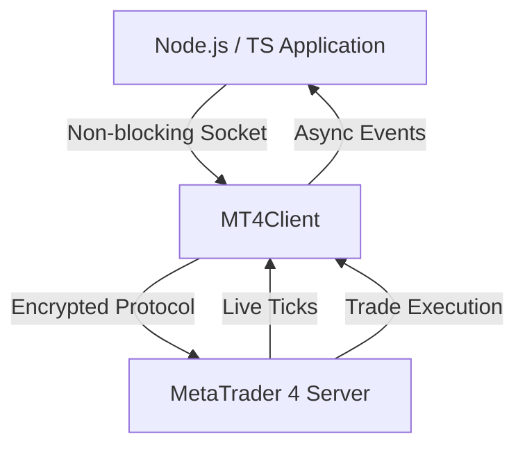

# NodeMT4 SDK

Welcome to the **NodeMT4 SDK** documentation. This high-performance Node.js and TypeScript library connects directly to MetaTrader 4 servers via non-blocking TCP sockets without requiring a local desktop terminal or Wine installation.

## Key Features

- **Pure JavaScript / TypeScript**: Zero native binary dependencies or Wine requirements.
- **Low Latency Market Feeds**: Event-driven price streaming for broker symbols.
- **Robust Order Execution**: Market orders, limit/stop pending orders, SL/TP modify, and position closing.
- **Modern Async/Await**: Clean Promises API with TypeScript definitions.

## Architecture



## Quick Installation

```bash
npm install @metarpc/nodemt4
```

See [Getting Started](getting-started.md) to begin trading.
